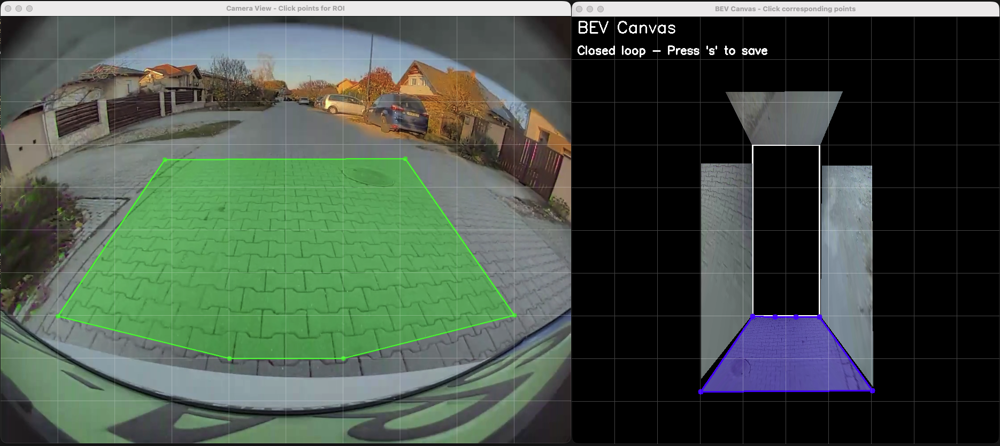

# BEV (Bird Eye View) 视频合成与标定工具

这是一个用于处理鸟瞰视图（BEV）视频的工具集，支持从多个摄像头视频合成BEV视图，并提供交互式标定工具。

## 写在前面
本项目是一个只花费几小时的极其简单用于Demo BEV是一个什么东西的项目
### 😈我做了什么

本项目实现了从多个摄像头视频合成鸟瞰视图（BEV）的基础功能。核心原理如下：

1. **单应性变换（Homography）**
   - 通过交互式标定工具，在摄像头视图和BEV画布上选择对应的ROI区域
   - 计算单应性矩阵H，建立摄像头视图到BEV画布的映射关系
   - 单应性矩阵可以将摄像头视角的图像投影到俯视的BEV画布上

2. **多视角融合**
   - 分别标定四个摄像头（前、后、左、右）的H矩阵
   - 使用透视变换（`cv2.warpPerspective`）将每个摄像头的ROI区域投射到BEV画布
   - 在BEV画布上叠加融合多个视角，形成完整的鸟瞰视图

3. **实时合成与播放**
   - 同步读取四个摄像头的视频帧
   - 实时应用H矩阵进行透视变换
   - 将变换后的图像合成到BEV画布上，实现实时BEV视频播放

**简单来说**：就像把四个不同角度的照片，通过数学变换"摊平"到一个俯视的地图上，让它们无缝拼接在一起，形成从上方俯视的完整视图。

### 😥还差点什么
1. **镜头的校准**
    -  正经鱼眼镜头是要校准的，我们可以通过传统的方式利用校准标识又快又好的校准，也可以把fx,fy,cx,cy这些参数以及一个打上辅助线的输出图像成对的一股脑的扔给多模态模型，让他调上几个回合。但很遗憾，暂时也没这个时间。本项目暂时没有完成无参照鱼眼镜头校准的部分。
2. **盲区的产生**
    - 没有做到360度的BEV，原因在于本次素材的四个视角，前视角来自于车内后视镜前的前摄像头，左右来自翼子板下方的两个摄像头用于对侧后盲区进行监测，而对于两个斜前方的视频，特斯拉会使用前面的广角摄像头（并不是视频里面这个视角，视频中的焦段偏长）和B柱上面的两个摄像头实现。我们没有这些图像信息，所以这一块就一片黑啦😭（详见[util.py - H矩阵标定工具](#1-utilpy---h矩阵标定工具)）
3. **时间差问题**
    - 其实你会发现，有的时候过减速带的时候，不同镜头之间的震动不是同步的，这个是因为时间戳没有完全对齐。对于这个问题，在代码中已经保留了offset的能力，有时间的友友可以去对一下时间戳看着更像那么回事。对于生产级别的项目，时间戳是需要更加严格的通过参数传入的。

### 🚴性能怎么样 & 能不能上车

**当前实现弱点：纯靠CPU**
- 使用 OpenCV 进行图像处理和视频编解码，性能依赖 CPU 计算
- 单应性变换（`cv2.warpPerspective`）在 CPU 上执行，对于高分辨率视频可能成为瓶颈
- 视频合成过程是同步的，需要等待所有摄像头帧读取完成

**性能表现（参考）：**
```
My Mac as reference:
sysctl -a | grep machdep.cpu
machdep.cpu.cores_per_package: 10
machdep.cpu.core_count: 10
machdep.cpu.logical_per_package: 10
machdep.cpu.thread_count: 10
machdep.cpu.brand_string: Apple M5
==================================================
性能统计摘要
==================================================
总帧数: 1866
总耗时: 43.88 秒
平均FPS: 42.53

各阶段平均耗时 (ms):
  读取帧: 1.48
  合成BEV: 18.56
  合成网格: 1.70
  合成最终帧: 0.22
  总耗时: 23.51

各阶段耗时占比 (%):
  读取帧: 6.7%
  合成BEV: 84.5%
  合成网格: 7.7%
  合成最终帧: 1.0%
==================================================
```
根据如上的测试结果，AI生成了一份在当前高通和英伟达旗舰平台下的性能评估，详见 [PLATFORM_PERFORMANCE.md](PLATFORM_PERFORMANCE.md)。从中我们可以看到，合成BEV占用了大量的时间，说明做专项GPU优化和针对OpenCL还有CUDA的硬件话加速是非常必要的。程序结构其实也可以用多线程和异步读取IO优化，这样可以减少读取帧这一块的占用时间。

### 🤪还能做什么
1. **停车小白和自动驾驶都爱BEV**
    
    - BEV不仅仅是提供给我们停车小白使用的，纯视觉自动驾驶也深度依赖BEV，[BEVtransformer](https://arxiv.org/abs/2203.17270)的架构会给可视的自动驾驶带来更大的动力。毕竟纯视觉的自动驾驶时更贴近直觉和真人驾驶的一种开车方式，也更是适合让车辆跟着人的思维去开车（当然啦，多几个lidar自然也好，谁不喜欢做fusion呢？算力跟上就好啦）

## 效果演示


## 应用场景

本工具主要用于：
- 从多个摄像头视频合成鸟瞰视图（BEV）✅
- 交互式标定摄像头与BEV画布之间的单应性矩阵 ✅
- 实时预览和播放合成的BEV视频 ✅
- 支持鱼眼镜头矫正参数调整 🕘


## 数据来源与致谢

本项目使用的示例视频数据来自 **Tesla Model 3** 车载相机拍摄的原始视频。

**数据来源**: [Hugging Face - tesla3_av_rosbags 数据集](https://huggingface.co/datasets/tfoldi/tesla3_av_rosbags/tree/main/rosbag2_2023_11_18-14_56_27/videos)

**重要提示**:
- 示例视频由 **Tesla Model 3** 的车载相机拍摄
- 如果使用其他车型的视频数据，需要重新进行标定
- 不同车型的摄像头位置、角度和参数可能不同，标定结果不能直接复用

感谢 [tfoldi](https://huggingface.co/tfoldi) 提供的 Tesla Model 3 自动驾驶数据集。


## 项目结构

```
BEV/
├── data/              # 视频文件目录
│   ├── sample1_front.mp4
│   ├── sample1_back.mp4
│   ├── sample1_left.mp4
│   ├── sample1_right.mp4
│   └── ...
├── config.yaml        # 配置文件（存储标定参数）
├── main.py           # 视频合成与播放工具
├── util.py           # H矩阵标定工具
├── fisheye_cal.py    # 鱼眼矫正工具
└── requirements.txt  # Python依赖包
```

## 安装依赖

```bash
pip install -r requirements.txt
```

依赖包：
- `opencv-python>=4.5.0`
- `numpy>=1.19.0`
- `pyyaml>=5.4.0`

## 工具介绍

### 1. util.py - H矩阵标定工具

用于创建和编辑BEV的单应性矩阵（Homography Matrix），通过交互式选择ROI区域来建立摄像头视图与BEV画布之间的对应关系。



#### 基本用法

```bash
python3 util.py --sample <样本编号> --position <摄像头位置> [选项]
```

#### 参数说明

- `--sample` (必需): 样本编号，例如 `1` 或 `2`
- `--position` (必需): 摄像头位置，可选值：`front`, `back`, `left`, `right`
- `--lines` (可选): 辅助线数量，默认 `6`。例如 `--lines 8` 表示横纵各8根辅助线
- `--cal` (可选): 校准模式，默认 `False`。设置为 `True` 时，保持BEV ROI不变，只调整摄像头ROI
- `--startfrom` (可选): 起始帧号，默认 `0`

#### 使用示例

```bash
# 标定front摄像头
python3 util.py --sample 1 --position front

# 使用8根辅助线标定left摄像头
python3 util.py --sample 1 --position left --lines 8

# 校准模式：只调整摄像头ROI，BEV ROI保持不变
python3 util.py --sample 1 --position front --cal True

# 从第100帧开始显示
python3 util.py --sample 1 --position front --startfrom 100
```

#### 操作说明

**普通模式（默认）：**

1. **选择摄像头ROI点**
   - 在摄像头视图中点击鼠标选择ROI点（至少3个点，建议按顺序点击）
   - 绿色标记显示已选择的点

2. **选择BEV画布对应点**
   - 在BEV画布上点击对应数量的点（按相同顺序）
   - 红色标记显示已选择的点

3. **闭合ROI**
   - 选择完最后一个点后，按 `c` 键闭合坐标组（连接最后一个点和第一个点）
   - 闭合后会自动保存配置并计算H矩阵（如果点数>=4）
   - 摄像头ROI区域会显示30%透明的绿色覆盖层

4. **其他操作**
   - `s`: 手动保存配置并计算H矩阵
   - `r`: 重新开始选择点（重置所有）
   - `k`: 重置当前焦点窗口的ROI（点击窗口后按k，只重置该窗口）
   - `l`: 撤销最后一个选择的点
   - `q`: 退出

**校准模式（`--cal True`）：**

1. 在摄像头视图中点击鼠标选择ROI点
2. 选择完最后一个点后，按 `c` 键闭合摄像头ROI
3. 闭合后会自动重新计算H矩阵并更新BEV画面（如果BEV ROI已存在）
4. 按 `r` 重新选择摄像头ROI（BEV ROI保持不变）
5. 按 `k` 重置当前焦点窗口的ROI
6. 按 `l` 撤销最后一个选择的点
7. 按 `s` 手动保存配置
8. 按 `q` 退出

#### 功能特性

- **辅助网格线**: 显示半透明的横纵辅助线，帮助精确标记点
- **实时预览**: 当相机配置和BEV ROI配置都存在时，自动将相机ROI投射到BEV画布对应区域
- **参考矩形**: BEV画布中心显示参考矩形（宽高比1:2.54，高度占画布40%）
- **智能H矩阵计算**: 
  - 4-7个点：直接使用所有点计算
  - 超过7个点：先尝试RANSAC，如果内点比例<80%则使用所有点计算，确保保持完整对应关系
- **配置自动保存**: ROI闭合后自动保存到 `config.yaml`

### 2. main.py - 视频合成与播放工具

用于合成和播放BEV视频，同时显示四个摄像头的原始视频和合成的BEV视图。


#### 基本用法

```bash
python3 main.py --sample <样本编号> [选项]
```

#### 参数说明

- `--sample` (必需): 样本编号，例如 `1` 或 `2`
- `--fo` (可选): front摄像头帧偏移，默认 `0`
- `--bo` (可选): back摄像头帧偏移，默认 `0`
- `--lo` (可选): left摄像头帧偏移，默认 `0`
- `--ro` (可选): right摄像头帧偏移，默认 `0`
- `--save` (可选): 是否保存视频，默认 `False`。设置为 `True` 时生成 `result_timestamp.mp4`

#### 使用示例

```bash
# 播放sample1的视频
python3 main.py --sample 1

# 调整各摄像头帧偏移以同步播放
python3 main.py --sample 1 --fo 10 --bo 5 --lo 8 --ro 12

# 保存合成视频
python3 main.py --sample 1 --save True
```

#### 界面说明

- **左侧四宫格**: 显示四个摄像头的原始视频
  - 窗口标题显示摄像头名称、当前帧号和偏移量（如果有）
  - 窗口大小根据BEV画布高度自动调整，保持宽高比

- **右侧BEV视图**: 显示合成的鸟瞰视图
  - 使用 `config.yaml` 中的H矩阵将各摄像头视图投射到BEV画布
  - 只显示ROI区域内的内容

#### 操作说明

- `p`: 暂停/继续播放
  - 暂停时会显示所有摄像头的当前帧号
  - 帧号信息会输出到控制台
- `q`: 退出程序

#### 循环播放

- 当视频播放到末尾时，会自动循环播放
- 所有摄像头和BEV会同步重置到各自的初始帧和偏移位置

## 配置文件 (config.yaml)

配置文件使用YAML格式，包含以下内容：

```yaml
bev:
  canvas_width: 800      # BEV画布宽度
  canvas_height: 800     # BEV画布高度
  reference_rect:
    aspect_ratio: 2.54   # 参考矩形宽高比
    width_ratio: 0.4     # 参考矩形高度占画布的比例

cameras:
  front:
    file_name: sample1_front.mp4
    offset_frame: 0
    src_roi: [[x1, y1], [x2, y2], ...]  # 摄像头ROI点
    dst_roi: [[x1, y1], [x2, y2], ...]  # BEV画布对应点
    H: [[...], [...], [...]]            # 单应性矩阵（3x3）
  # ... 其他摄像头配置
```

### 配置说明

- `src_roi`: 摄像头视图中的ROI点坐标列表
- `dst_roi`: BEV画布中对应的点坐标列表
- `H`: 3x3单应性矩阵，用于将摄像头视图投射到BEV画布
- `fisheye_K` 和 `fisheye_D`: 鱼眼矫正参数（如果使用 `fisheye_cal.py` 标定）

## 工作流程

### 首次使用

1. **准备视频文件**
   - 将视频文件放入 `data/` 目录
   - 命名格式：`sample{编号}_{位置}.mp4`，例如 `sample1_front.mp4`

2. **标定H矩阵**
   ```bash
   # 依次标定四个摄像头
   python3 util.py --sample 1 --position front
   python3 util.py --sample 1 --position back
   python3 util.py --sample 1 --position left
   python3 util.py --sample 1 --position right
   ```
   - 在摄像头视图中选择ROI区域
   - 在BEV画布中选择对应的目标区域
   - 闭合ROI后自动保存配置

3. **播放和查看**
   ```bash
   python3 main.py --sample 1
   ```

### 调整标定

如果标定结果不理想，可以使用校准模式：

```bash
# 保持BEV ROI不变，只调整摄像头ROI
python3 util.py --sample 1 --position front --cal True
```

## 注意事项

1. **点选择顺序**: 摄像头ROI和BEV ROI的点必须按相同顺序选择
2. **最少点数**: 至少需要4个点才能计算H矩阵
3. **视频同步**: 如果各摄像头视频不同步，使用 `--fo`, `--bo`, `--lo`, `--ro` 参数调整帧偏移
4. **配置文件**: 标定结果会自动保存到 `config.yaml`，建议定期备份

## 故障排除

### util.py 问题

- **H矩阵计算失败**: 确保选择了至少4个点，且摄像头ROI和BEV ROI点数相同
- **点选择错误**: 使用 `l` 键撤销，或使用 `k` 键重置当前窗口的ROI

### main.py 问题

- **视频无法打开**: 检查视频文件路径和文件名是否正确
- **BEV视图空白**: 检查 `config.yaml` 中是否有有效的H矩阵
- **视频不同步**: 使用帧偏移参数（`--fo`, `--bo`, `--lo`, `--ro`）调整

## 许可证

本项目仅供学习和研究使用。
